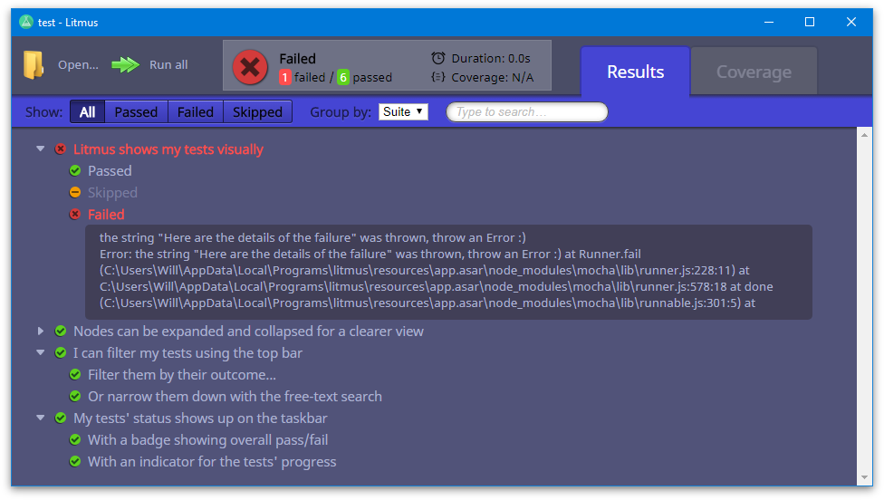

# Litmus


## Rationale

Many modern JS frameworks need configuration or other orchestration as part of a build chain. There can be quite a steep learing curve, which can be overwhelming, if not outright demotivating, to someone just starting out. Litmus is aimed at being as easy as possible to just "get up and go" and begin testing a Javascript project; without having to understand and configure a stack of tools.

There are a great many command-line test runners available on the web, but no _visual_ test runners that I am aware of. A command line interface is another barrier-to-entry that I wanted to elimate. As I'm unaware of a visual runner being attempted, I wanted to see if such a thing could work in practice.

Finally, it is also a chance for me to experiment with and learn more about web technologies, cross-platform development, and the wider Javascript ecosystem in general.


## Developer quick-start
```
npm install
npm run build
npm start
```

When setting the environment variable `LITMUS_DEV`:
 * DevTools will be available in the UI (keyboard shortcut `F12`)
 * The background test runner window will be visible and available for debugging (via the DevTools)

### Testing
Simply run Litmus, and select the project directory. Voilà, Litmus will find and run the tests, and display the outcome on the screen for you.

Or, you can run this command if you prefer the old-fashioned way ;)
```
npm run test
```
> Litmus's own tests are pretty bad at the moment 😱 (though I hope to change this soon). I've been more concerned with getting things working and experimenting with ideas.

### Hanging builds
This unfortunately sometimes happens 😭. This can require multiple retries, and if that doesn't work, try removing the `.cache` directory and running `npm run build` again.

### Packaging for distribution
```
npm run pack
```
This command will produce a distributable package suitable for whichever operating system the command is being run on (`EXE`, `DMG`, or `AppImage`)

## Architechture overview
Limtus is written in Typescript, and built upon Electron.

The app has three "threads" of execution runnng at all times, which have the following entry points:
* **index.ts** - Electron main process. Handles interaction with the OS.
* **ui/index.html** - Main Window UI. Mostly plain HTML and (transpiled) Javascript. A couple of pieces are React components.
* **ui/backgroundTestRunnerWorker.html** - An invisible window that hosts the test runner process. As test results become available, they are pushed to the main UI (`index.html`) for rendering.


## Changelog
### 0.1.1
* Linux packaging
### 0.1.0
* Initial MVP. Windows only.
* Runs Mocha tests and displays the results.
* Taskbar progress indicator
* Searching, filtering, and grouping are working.
* ** **Very much a work in progess** **
